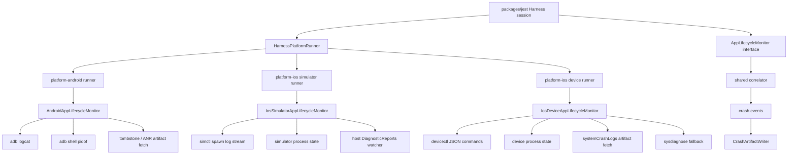

# ADR 0001: App Lifecycle Crash Monitor

Date: 2026-05-20

Status: Proposed

## Context

React Native Harness needs to re-implement native crash detection from scratch. The replacement must be cross-platform, but it must not treat Android, iOS Simulator, and physical iOS devices as equivalent systems. The platform tooling provides different evidence, different latency, and different levels of confidence.

The current Harness launch architecture already has the right high-level shape:

- `packages/jest` orchestrates Metro, platform runner creation, app readiness, app restarts, test execution, crash races, and teardown.
- `packages/platforms` defines the shared `HarnessPlatformRunner` and monitor-facing types.
- `packages/platform-android` owns Android target resolution and app launch through `adb`.
- `packages/platform-ios` owns iOS Simulator launch through `simctl` and physical-device launch through `devicectl`.

The new crash monitor should preserve this ownership. The Jest layer may know that an app launch, restart, stop, or test execution phase is happening, but it must not know how `adb`, `simctl`, or `devicectl` work. Platform packages may know platform tools, but they should expose them through a small shared monitor contract.

We also agreed to avoid optional monitor metadata that forces orchestration code to branch. Instead, every platform runner should provide an `AppLifecycleMonitor` implementation. When monitoring is disabled or unsupported, the platform should return a noop monitor implementing the same interface.

## Decision

Implement crash detection as a platform-specific set of `AppLifecycleMonitor` implementations behind one shared interface.

`packages/jest` will drive the monitor linearly:

1. Create the platform runner.
2. Create the app monitor.
3. Start the monitor before the run.
4. Notify the monitor around app launch, restart, and stop operations.
5. Race test execution and startup readiness against `monitor.watch(...)`.
6. Stop or reset the monitor around controlled restarts.
7. Dispose the monitor during session teardown.

Platform packages will return concrete monitor implementations:

- Android: `AndroidAppLifecycleMonitor`
- iOS Simulator: `IosSimulatorAppLifecycleMonitor`
- iOS physical device: `IosDeviceAppLifecycleMonitor`
- Disabled or unsupported: `NoopAppLifecycleMonitor`

The shared monitor contract will be non-optional. The orchestration layer always talks to a monitor. Some monitors observe nothing.

## Goals

- Detect native and runtime crashes with low latency when platform tooling supports it.
- Preserve high-confidence confirmation through process state and crash artifacts.
- Keep `packages/jest` platform-neutral.
- Keep platform command details inside platform packages.
- Keep monitor usage linear, with no optional `monitorTarget` checks.
- Improve testability by separating lifecycle orchestration, evidence collection, correlation, and artifact persistence.
- Preserve `detectNativeCrashes` as the user-facing toggle, but implement it by choosing a real or noop monitor.

## Non-Goals

- Do not build a single generic "process died means crash" engine.
- Do not make physical iOS devices pretend to have Android-style realtime crash streams.
- Do not require native app instrumentation for the baseline implementation.
- Do not couple Jest orchestration to `adb`, `simctl`, `devicectl`, or platform command arguments.
- Do not use the old crash monitor implementation as a design constraint.
- Do not upload raw crash artifacts to external services by default.
- Do not rely on native app changes such as Android `ApplicationExitInfo` bridges or iOS Darwin notification heartbeats in the baseline. The app should be treated as a black box from the native side.
- Do not perform symbolication in v1. Persist raw platform artifacts and summarize them enough to identify the crash.

## Architecture



The shared interface is intentionally small. It models lifecycle notifications, crash watches, and resource management. It does not expose platform-specific command handles.

## Shared Interfaces

The exact names may change during implementation, but the shape should remain stable.

```ts
export type AppLifecyclePhase = 'startup' | 'execution';

export type AppLifecycleEventBase = {
  launchId: string;
  at: number;
};

export type LaunchRequestedEvent = AppLifecycleEventBase & {
  type: 'launch_requested';
  reason: 'start' | 'restart' | 'ensure_ready';
};

export type LaunchCompletedEvent = AppLifecycleEventBase & {
  type: 'launch_completed';
  reason: 'start' | 'restart' | 'ensure_ready';
};

export type LaunchFailedEvent = AppLifecycleEventBase & {
  type: 'launch_failed';
  reason: 'start' | 'restart' | 'ensure_ready';
  error: unknown;
};

export type StopRequestedEvent = {
  type: 'stop_requested';
  at: number;
  reason: 'restart' | 'dispose' | 'coverage' | 'manual';
};

export type StopCompletedEvent = {
  type: 'stop_completed';
  at: number;
  reason: 'restart' | 'dispose' | 'coverage' | 'manual';
};

export type CrashWatch = {
  promise: Promise<never>;
  cancel: () => void;
};

export type AppLifecycleMonitor = {
  start: () => Promise<void>;
  stop: () => Promise<void>;
  dispose: () => Promise<void>;

  launchRequested: (event: LaunchRequestedEvent) => void;
  launchCompleted: (event: LaunchCompletedEvent) => void;
  launchFailed: (event: LaunchFailedEvent) => void;
  stopRequested: (event: StopRequestedEvent) => void;
  stopCompleted: (event: StopCompletedEvent) => void;

  watch: (testFilePath: string, phase: AppLifecyclePhase) => CrashWatch;
  reset: () => void;
  isAlive: () => boolean;
};
```

The noop implementation must implement the same contract:

```ts
export const createNoopAppLifecycleMonitor = (): AppLifecycleMonitor => ({
  start: async () => undefined,
  stop: async () => undefined,
  dispose: async () => undefined,

  launchRequested: () => undefined,
  launchCompleted: () => undefined,
  launchFailed: () => undefined,
  stopRequested: () => undefined,
  stopCompleted: () => undefined,

  watch: () => ({
    promise: new Promise<never>(() => undefined),
    cancel: () => undefined,
  }),

  reset: () => undefined,
  isAlive: () => true,
});
```

The platform runner interface should keep a single creation method:

```ts
export type CreateAppMonitorOptions = {
  crashArtifactWriter?: CrashArtifactWriter;
};

export type HarnessPlatformRunner = {
  startApp: (options?: AppLaunchOptions) => Promise<void>;
  restartApp: (options?: AppLaunchOptions) => Promise<void>;
  stopApp: () => Promise<void>;
  dispose: () => Promise<void>;
  isAppRunning: () => Promise<boolean>;
  createAppMonitor: (options?: CreateAppMonitorOptions) => AppLifecycleMonitor;
};
```

There should be no optional `monitorTarget` property. Target information is captured by the platform implementation when it constructs the monitor.

## Platform Monitor Construction

Android platform instances already resolve:

- `adbId`
- `bundleId`
- `activityName`
- `appUid`

They should construct either:

```ts
createAndroidAppLifecycleMonitor({
  adbId,
  bundleId,
  appUid,
  isAppRunning: () => adb.isAppRunning(adbId, bundleId),
  crashArtifactWriter,
});
```

or a noop monitor when `detectNativeCrashes === false`.

iOS Simulator platform instances already resolve:

- `udid`
- `bundleId`

They should construct either:

```ts
createIosSimulatorAppLifecycleMonitor({
  udid,
  bundleId,
  isAppRunning: () => simctl.isAppRunning(udid, bundleId),
  crashArtifactWriter,
});
```

or a noop monitor when disabled.

iOS physical-device platform instances already resolve:

- CoreDevice `deviceId`
- hardware `udid`
- `bundleId`

They should construct either:

```ts
createIosDeviceAppLifecycleMonitor({
  deviceId,
  hardwareUdid: device.hardwareProperties.udid,
  bundleId,
  isAppRunning: () => devicectl.isAppRunning(deviceId, bundleId),
  crashArtifactWriter,
});
```

or a noop monitor when disabled.

## Jest Dependency Chain

The Jest package should remain the lifecycle conductor.

Current dependency chain:

```txt
packages/jest
  imports platform runner dynamically
  creates platformInstance
  creates crashArtifactWriter
  creates appMonitor through platformInstance.createAppMonitor()
  starts appMonitor before run
  uses crashMonitor/watch while waiting for readiness and test execution
  stops/resets around restarts
  disposes monitor during session teardown
```

Target dependency chain:

```txt
packages/jest
  depends on:
    packages/platforms types
    platformInstance.createAppMonitor()
    AppLifecycleMonitor methods

packages/platforms
  depends on:
    shared type definitions only

packages/platform-android
  depends on:
    adb helpers
    Android logcat/process/artifact collectors
    shared AppLifecycleMonitor type

packages/platform-ios
  depends on:
    simctl helpers
    devicectl helpers
    iOS log/process/artifact collectors
    shared AppLifecycleMonitor type

packages/tools
  depends on:
    filesystem artifact persistence
```

`packages/jest` must not import `adb`, `simctl`, or `devicectl`.

## Jest Orchestration Rules

The app lifecycle monitor should receive notifications around all controlled app lifecycle operations.

For direct launch:

```ts
const launchId = randomUUID();
monitor.launchRequested({
  type: 'launch_requested',
  launchId,
  at: Date.now(),
  reason: 'start',
});

try {
  await platformInstance.startApp(appLaunchOptions);
  monitor.launchCompleted({
    type: 'launch_completed',
    launchId,
    at: Date.now(),
    reason: 'start',
  });
} catch (error) {
  monitor.launchFailed({
    type: 'launch_failed',
    launchId,
    at: Date.now(),
    reason: 'start',
    error,
  });
  throw error;
}
```

For restart:

```ts
await monitor.stop();

monitor.stopRequested({
  type: 'stop_requested',
  at: Date.now(),
  reason: 'restart',
});

await platformInstance.stopApp();

monitor.stopCompleted({
  type: 'stop_completed',
  at: Date.now(),
  reason: 'restart',
});

monitor.reset();
await monitor.start();

const launchId = randomUUID();
monitor.launchRequested({
  type: 'launch_requested',
  launchId,
  at: Date.now(),
  reason: 'restart',
});

await platformInstance.startApp(appLaunchOptions);

monitor.launchCompleted({
  type: 'launch_completed',
  launchId,
  at: Date.now(),
  reason: 'restart',
});
```

When the existing `platformInstance.restartApp(...)` method is used directly, Jest should still emit one logical stop window and one logical launch window around the call:

```ts
const launchId = randomUUID();

monitor.stopRequested({ type: 'stop_requested', at: Date.now(), reason: 'restart' });
monitor.launchRequested({ type: 'launch_requested', launchId, at: Date.now(), reason: 'restart' });

try {
  await platformInstance.restartApp(appLaunchOptions);
  monitor.stopCompleted({ type: 'stop_completed', at: Date.now(), reason: 'restart' });
  monitor.launchCompleted({ type: 'launch_completed', launchId, at: Date.now(), reason: 'restart' });
} catch (error) {
  monitor.launchFailed({ type: 'launch_failed', launchId, at: Date.now(), reason: 'restart', error });
  throw error;
}
```

For test execution:

```ts
const crashWatch = monitor.watch(testPath, 'execution');
crashWatch.promise.catch(() => undefined);

try {
  return await Promise.race([
    conn.runTests(testPath, { ...options, runner: platform.runner }),
    crashWatch.promise,
  ]);
} finally {
  crashWatch.cancel();
}
```

For startup readiness:

```ts
const crashWatch = monitor.watch(testPath, 'startup');
crashWatch.promise.catch(() => undefined);

try {
  return await Promise.race([
    waitForBridgeReady(),
    crashWatch.promise,
  ]);
} finally {
  crashWatch.cancel();
}
```

## Shared Detection Model

All real monitors should normalize evidence into the same conceptual model.

```ts
type CrashSignal = {
  id: string;
  platform: 'android' | 'ios-simulator' | 'ios-device';
  kind:
    | 'java-exception'
    | 'native-crash'
    | 'anr'
    | 'watchdog'
    | 'process-exit'
    | 'crash-report'
    | 'device-offline'
    | 'unknown';
  confidence: 'low' | 'medium' | 'high';
  occurredAt: number;
  launchId?: string;
  pid?: number;
  processName?: string;
  summary?: string;
  rawLines?: string[];
  artifactPath?: string;
};
```

The monitor should emit two internal stages:

- `crashSuspected`: first strong signal, optimized for low latency.
- `crashConfirmed`: corroborated by process exit, crash artifact, tombstone, ANR trace, or platform exit reason.

The public `watch(...)` promise should reject with the existing runtime failure shape used by Jest, for example `NativeCrashError`, once the monitor has enough evidence to report a crash. Monitors should wait for a short 1 to 3 second correlation window before rejecting so related evidence can be gathered and attached to the failure. If a suspected crash is not corroborated, the monitor may keep it as degraded evidence or report a warning, but it should avoid failing tests on weak evidence alone except for the physical iOS policy described below.

## Correlation Model

Use an instance key instead of bare PID.

Android instance key:

```txt
(adbId, bundleId, pid, firstSeenMonotonic)
```

iOS Simulator instance key:

```txt
(udid, bundleId, launchId or launchEpoch)
```

iOS device instance key:

```txt
(deviceId, bundleId, launchId or crashTimestampBucket)
```

Correlation rules:

1. Open a suspicion window when the first fatal signal arrives.
2. Collect related evidence for 1 to 3 seconds.
3. Confirm if process loss, restart, exit reason, crash file, tombstone, ANR trace, or device crash log appears.
4. Emit one consolidated crash failure.
5. Suppress duplicates until a new app instance starts or a cooldown expires.

Controlled stops must not be reported as crashes. Jest should call `stopRequested` before controlled stops, and monitors should suppress process-exit evidence during that window.

## Android Commands

The Android launcher currently starts apps with:

```bash
adb -s <adbId> shell am start \
  -a android.intent.action.MAIN \
  -c android.intent.category.LAUNCHER \
  -n <bundleId>/<activityName>
```

Launch extras:

```bash
--es <key> <string-value>
--ez <key> true|false
--ei <key> <integer-value>
```

Controlled stop:

```bash
adb -s <adbId> shell am force-stop <bundleId>
```

Process check:

```bash
adb -s <adbId> shell pidof <bundleId>
```

Realtime crash stream:

```bash
adb -s <adbId> logcat -b crash -b main -b system -v threadtime
```

Optional event buffer:

```bash
adb -s <adbId> logcat -b crash -b main -b system -b events -v threadtime
```

Native tombstone retrieval when accessible:

```bash
adb -s <adbId> shell ls -t /data/tombstones
adb -s <adbId> pull /data/tombstones/<tombstone-file> <artifact-dir>
```

ANR retrieval when accessible:

```bash
adb -s <adbId> shell ls -t /data/anr
adb -s <adbId> pull /data/anr/<newest-anr-file> <artifact-dir>
```

## Android Detection Logic

The Android monitor should start a long-lived logcat subprocess and a process poller.

Recommended collectors:

- `LogcatSession`
- `AndroidProcessPoller`
- `AndroidArtifactFetcher`
- optional `ApplicationExitInfo` app-side bridge later

High-confidence logcat signals:

- tag `AndroidRuntime` with message containing `FATAL EXCEPTION`
- debuggerd or tombstone banners
- native abort markers
- visible ActivityManager crash markers
- ANR markers such as `am_anr` when the events buffer is enabled

Process polling:

- Poll `pidof <bundleId>` at a modest interval, for example 250 to 500 ms during active test execution.
- Treat PID disappearance as neutral by itself.
- Treat PID disappearance inside a suspicion window as confirming evidence.
- Do not require PID disappearance to confirm a Java/Kotlin crash. On physical devices, the system crash dialog can keep the crashed app process visible after `AndroidRuntime` and `am_crash` have already identified the crash.
- Treat immediate PID replacement as a restart and use the instance key to avoid merging old and new evidence.
- Suppress PID disappearance during a controlled stop window opened by `stopRequested`.

Suggested Android flow:

```ts
onLogcatLine(line) {
  const record = parseThreadtime(line);
  ringBuffer.push(line);

  if (record.tag === 'AndroidRuntime' && record.message.includes('FATAL EXCEPTION')) {
    suspectCrash({ kind: 'java-exception', pid: record.pid, confidence: 'high' });
    openEvidenceWindow({ durationMs: 1000 });
  }

  if (looksLikeActivityManagerCrash(line)) {
    confirmCrash({
      reason: 'activity-manager-crash-record',
      kind: 'java-exception',
      confidence: 'high',
    });
    fetchFastArtifacts();
  }

  if (looksLikeDebuggerdBanner(line) || looksLikeNativeAbort(line)) {
    suspectCrash({ kind: 'native-crash', pid: record.pid, confidence: 'high' });
  }

  if (looksLikeAnrEvent(line)) {
    suspectCrash({ kind: 'anr', confidence: 'medium' });
  }
}

onPidPoll(nextPid) {
  if (controlledStopWindow.isOpen()) {
    updateCurrentPid(nextPid);
    return;
  }

  if (currentPid && !nextPid && suspicionWindow.hasRecentSignal()) {
    confirmCrash({ reason: 'process-exit-after-fatal-signal' });
    fetchFastArtifacts();
    return;
  }

  if (currentPid && !nextPid) {
    recordGoneUnknown();
    fetchExitReasonFallbackIfAvailable();
    return;
  }

  if (!currentPid && nextPid) {
    markAppStarted({ pid: nextPid });
  }
}
```

Android artifact policy:

- Always persist the relevant logcat ring buffer for confirmed crashes.
- For Java/Kotlin crashes, persist the `AndroidRuntime` stack excerpt and nearby `am_crash` / ActivityManager lines. This is v1's primary Android diagnostic artifact.
- Try tombstones for suspected native crashes.
- Try ANR traces for suspected ANRs.
- Treat artifact fetch failure as a warning, not as a monitor failure, because production devices often block `/data/anr` and `/data/tombstones`.

## Android Emulator Crash Experiment

The playground app has DEBUG-only Android crash modes in `apps/playground/android/app/src/main/java/com/harnessplayground/MainActivity.kt`. Unlike iOS, the mode is supplied through an intent extra:

```bash
adb -s <serial> shell am start \
  -a android.intent.action.MAIN \
  -c android.intent.category.LAUNCHER \
  -n com.harnessplayground/.MainActivity \
  --es harness_crash_mode pre_rn
```

Relevant modes:

- `pre_rn`: throws `IllegalStateException("Intentional pre-RN startup crash")` before React Native startup.
- `delayed_pre_ready`: schedules `IllegalStateException("Intentional delayed startup crash")` after roughly 1 second.

Observed on 2026-05-20:

- Device: Pixel_8_API_35 emulator, Android 15 / API 35, `emulator-5554`.
- App: `com.harnessplayground`, debug APK.
- Log source: `adb logcat -b crash -b main -b system -b events -v threadtime`.
- Process source: `adb shell pidof com.harnessplayground`.

Results:

- `pre_rn`: process first observed after 261 ms; `AndroidRuntime` `FATAL EXCEPTION` logged 404 ms after ActivityTaskManager start; PID disappeared after 531 ms.
- `delayed_pre_ready`: process first observed after 259 ms; `AndroidRuntime` `FATAL EXCEPTION` logged 1599 ms after ActivityTaskManager start; PID disappeared after 1812 ms.
- `am_crash` / `Force finishing activity` appeared in logcat for both crashes.
- No new tombstone files were created, as expected for Java/Kotlin exceptions.
- `/data/anr` and `/data/tombstones` were accessible on this emulator, but no new ANR/tombstone artifact was relevant to these Java crash cases.

Experiment notes:

- For Java/Kotlin crashes, logcat is the best first signal. PID disappearance follows shortly, but it should be corroborating evidence rather than the primary detector.
- The events buffer can contain older `am_crash` records if the buffer is not fully cleared or if a monitor starts mid-run. Long-lived monitoring should prefer monotonic stream position and launch-time filtering over naive "first matching line in dump" parsing.
- For test scripts that clear buffers, clear the same buffers the monitor reads, for example `adb logcat -b crash -b main -b system -b events -c`, or use `-T` / launch-time filtering.
- Android may show an app crash dialog, but unlike Simulator the fatal log evidence arrives before any human action is needed. The monitor must ignore the dialog and rely on logcat/process evidence.

## Physical Android Crash Experiment

The same playground Android crash modes were validated on a connected physical device.

Observed on 2026-05-20:

- Device: physical Android phone, Android 13 / API 33.
- App: `com.harnessplayground`, debug APK.
- Log source: `adb logcat -b crash -b main -b system -b events -v threadtime`.
- Process source: `adb shell pidof com.harnessplayground`.
- Artifact probes: `adb shell ls -t /data/anr` and `adb shell ls -t /data/tombstones`.

Results:

- `pre_rn`: process first observed after 418 ms; `AndroidRuntime` `FATAL EXCEPTION` logged 829 ms after ActivityTaskManager start; `am_crash` logged after 839 ms; ActivityManager process death logged after 918 ms; PID disappeared after 1138 ms.
- `delayed_pre_ready`: process first observed after 387 ms; `AndroidRuntime` `FATAL EXCEPTION` logged 1950 ms after ActivityTaskManager start; `am_crash` logged after 1955 ms; PID was still visible after the polling window.
- `pre_rn` stack excerpt included `IllegalStateException: Intentional pre-RN startup crash`, `MainActivity.kt:20`, and `MainActivity.kt:38`.
- `delayed_pre_ready` stack excerpt included `IllegalStateException: Intentional delayed startup crash` and `MainActivity.kt:31`.
- `/data/anr` was listable on this device, but no new ANR artifact was produced for these Java crashes.
- `/data/tombstones` was not accessible: `Permission denied`.
- No new tombstones were produced, as expected for Java/Kotlin exceptions.

Experiment notes:

- Physical Android confirmed that logcat alone can provide actionable raw stack traces without symbolication.
- `AndroidRuntime` plus `am_crash` should be confirmation-grade evidence for Java/Kotlin crashes. Waiting for PID disappearance alone is too strict because the OS crash dialog can leave the process visible.
- PID disappearance remains useful corroboration, and it remains important for unknown exits, native crashes, and restarts.
- Production-like physical devices may block tombstones, so the monitor must not depend on `/data/tombstones` access for v1 Java crash reporting.
- The v1 Android report should include the exception class/message, process/PID, app stack frames, `am_crash`, and nearby ActivityManager lines from the ring buffer.

## iOS Simulator Commands

Simulator discovery:

```bash
xcrun simctl list devices --json
```

Boot:

```bash
xcrun simctl boot <udid>
xcrun simctl bootstatus <udid> -b
```

Install:

```bash
xcrun simctl install <udid> <app-path>
```

Launch:

```bash
xcrun simctl launch <udid> <bundleId> [...arguments]
```

Launch environment:

```txt
SIMCTL_CHILD_<KEY>=<VALUE>
```

Terminate:

```bash
xcrun simctl terminate <udid> <bundleId>
```

Recommended realtime log stream:

```bash
xcrun simctl spawn <udid> log stream \
  --style json \
  --level debug \
  --predicate 'process == "<processName>" OR process == "<bundleId>" OR subsystem == "<bundleId>"'
```

Fallback stream if JSON style is unavailable:

```bash
xcrun simctl spawn <udid> log stream \
  --style compact \
  --level info \
  --predicate '<predicate>'
```

Simulator diagnostic fallback:

```bash
xcrun simctl diagnose --udid=<udid> --no-archive --output=<output-dir> -b
```

Host crash report location to watch:

```txt
~/Library/Logs/DiagnosticReports
```

## iOS Simulator Detection Logic

The simulator monitor should use three signal sources:

- unified log stream through `simctl spawn <udid> log stream`
- app process state through existing simulator helpers
- host crash report file watcher

Recommended collectors:

- `SimctlUnifiedLogStream`
- `IosSimulatorProcessPoller`
- `DiagnosticReportsWatcher`
- optional `SimctlDiagnoseCollector`

Signals:

- fatal-looking unified log records
- abort/watchdog/native exception terms in logs
- app process disappearance after a fatal-looking record or immediately after a Harness-controlled launch
- new `.ips` or `.crash` report in `~/Library/Logs/DiagnosticReports`
- simulator diagnostic bundle containing a matching crash report

Crash report matching:

- Prefer filename prefix matching by process name when available.
- Parse `.ips` and `.crash` contents.
- Confirm reports that mention the simulator UDID or otherwise match the current launch time and process.
- Filter reports older than the current launch or current run timestamp.

Suggested iOS Simulator flow:

```ts
onSimLogRecord(record) {
  ringBuffer.push(record);

  if (looksFatal(record) || looksAbort(record) || looksWatchdog(record)) {
    suspectCrash({
      platform: 'ios-simulator',
      kind: classifyIosFatal(record),
      confidence: 'medium',
    });
  }
}

onCrashFileCreated(path) {
  const parsed = parseCrashReport(path);

  if (!matchesBundleOrProcess(parsed)) {
    return;
  }

  if (!matchesCurrentSimulator(parsed, udid)) {
    return;
  }

  confirmCrash({
    kind: 'crash-report',
    confidence: 'high',
    artifactPath: persist(path),
  });
}

onProcessPoll(isRunning) {
  if (controlledStopWindow.isOpen()) {
    return;
  }

  if (!isRunning && suspicionWindow.hasRecentSignal()) {
    confirmCrash({ reason: 'process-exit-after-fatal-signal' });
  }

  if (!isRunning && currentLaunchIsRecent()) {
    suspectCrash({
      platform: 'ios-simulator',
      kind: 'process-exit',
      confidence: 'medium',
    });
    waitForCrashReport({ graceMs: 3000 });
  }
}
```

The simulator path should usually be able to produce a low-latency `crashSuspected` event from process disappearance and a high-confidence `crashConfirmed` event from the host crash report.

## iOS Simulator Artifact Experiment

The same playground crash modes used for the physical iPhone experiment also work on Simulator through `SIMCTL_CHILD_HARNESS_CRASH_MODE`.

Experiment command shape:

```bash
SIMCTL_CHILD_HARNESS_CRASH_MODE=pre_rn \
  xcrun simctl launch <udid> com.harnessplayground
```

The experiment measured:

- host PID returned by `simctl launch`;
- time until that PID disappeared from `ps`;
- time until a matching `HarnessPlayground-*.ips` appeared in `~/Library/Logs/DiagnosticReports`;
- whether `simctl spawn <udid> log stream` produced useful crash evidence.

Observed on 2026-05-20:

- Simulator: iPhone 17 Pro, iOS 26.4.1 runtime.
- Toolchain: Xcode 17E202.
- Crash modes: `pre_rn` and `delayed_pre_ready`.
- Initial post-install `pre_rn` run: crash report appeared after 10943 ms.
- Repeat `pre_rn` run 1: PID disappeared after 938 ms; crash report appeared after 2276 ms.
- Repeat `pre_rn` run 2: PID disappeared after 837 ms; crash report appeared after 2174 ms.
- `delayed_pre_ready` run: PID disappeared after 1917 ms; crash report appeared after 3269 ms.
- `pre_rn` run with the macOS Problem Reporter dialog intentionally left untouched: PID disappeared after 925 ms; crash report appeared after 1599 ms.
- All copied `.ips` files contained `bundleID` / `CFBundleIdentifier` for `com.harnessplayground`.
- `simctl spawn <udid> log stream` with process/fatal predicates did not produce useful app crash evidence in these runs.

The user also observed the macOS Problem Reporter dialog saying the app crashed, with `Ignore` and `Report` actions. The monitor must not rely on this dialog or require a human action. It also should not assume the dialog blocks artifact creation; in these runs, valid `.ips` files appeared while the dialog was visible and while it was intentionally left untouched.

Initial conclusion:

- For Simulator, process disappearance is the best low-latency suspected-crash signal.
- Host DiagnosticReports is the best confirmation source.
- Use the same 3 second artifact grace window as physical iOS, but allow late `reportReady` because the first post-install run took about 11 seconds.
- Treat unified log streaming as opportunistic context, not the primary simulator crash detector, until a stronger predicate/stream source is validated.
- The implementation should document or eventually automate crash-dialog suppression for local/CI runs if it becomes disruptive.

## iOS Physical Device Commands

Device discovery must use JSON file output:

```bash
xcrun devicectl list devices --json-output <temp-json-file>
```

Device details:

```bash
xcrun devicectl device info details \
  --device <deviceId> \
  --json-output <temp-json-file>
```

Installed app lookup:

```bash
xcrun devicectl device info apps \
  --device <deviceId> \
  --json-output <temp-json-file>
```

Filter the JSON result by `bundleIdentifier` in Node. Do not rely on a `--bundle-id` flag being available across Xcode versions.

Launch:

```bash
xcrun devicectl device process launch \
  --device <deviceId> \
  --json-output <temp-json-file> \
  <bundleId>
```

Launch with environment:

```bash
xcrun devicectl device process launch \
  --device <deviceId> \
  --environment-variables '{"KEY":"VALUE"}' \
  --json-output <temp-json-file> \
  <bundleId>
```

Launch with arguments:

```bash
xcrun devicectl device process launch \
  --device <deviceId> \
  --json-output <temp-json-file> \
  <bundleId> \
  <arg1> <arg2>
```

For `device process launch`, keep all `devicectl` options before `<bundleId>`. Values after `<bundleId>` are treated as app command-line arguments.

Process list:

```bash
xcrun devicectl device info processes \
  --device <deviceId> \
  --json-output <temp-json-file>
```

Terminate:

```bash
xcrun devicectl device process terminate \
  --device <deviceId> \
  --pid <pid> \
  --json-output <temp-json-file>
```

List crash logs:

```bash
xcrun devicectl device info files \
  --device <deviceId> \
  --domain-type systemCrashLogs \
  --recurse \
  --json-output <temp-json-file>
```

Copy crash log:

```bash
xcrun devicectl device copy from \
  --device <deviceId> \
  --source <remote-crash-log-path> \
  --destination <local-output-file> \
  --domain-type systemCrashLogs \
  --json-output <temp-json-file>
```

For single-file crash logs, pass a full local destination filename. On the tested Xcode 17E202 / `devicectl` 518.27 toolchain, passing an existing directory as `--destination` failed with `Cannot open destination file ... Is a directory`.

Heavy fallback:

```bash
xcrun devicectl device sysdiagnose \
  --device <deviceId> \
  --json-output <temp-json-file>
```

The command shape should be validated against the locally installed Xcode's `xcrun devicectl help`. Scripts must consume `--json-output` files instead of scraping stdout.

## iOS Physical Device Detection Logic

Physical iOS device support is intentionally conservative. The monitor should not assume a stable generic realtime crash stream equivalent to Android logcat.

Recommended collectors:

- `DevicectlProcessPoller`
- `IosDeviceCrashLogCollector`
- optional `DevicectlLaunchResultTracker`
- optional `DarwinNotificationHeartbeat` if an app-assisted heartbeat is added later
- optional `DevicectlSysdiagnoseCollector`

Signals:

- app process disappears after a launch and outside a controlled stop window
- a matching crash log appears in `systemCrashLogs`
- `devicectl process launch` JSON provides launch/process metadata
- optional heartbeat disappears in app-assisted mode
- sysdiagnose contains matching crash reports after escalation

Process matching:

- Get app info for `bundleId`.
- Use app `url` from `devicectl device info apps`.
- List running processes.
- Match processes whose executable starts with the app `url`.

Suggested physical iOS flow:

```ts
onLaunchCompleted(event) {
  currentLaunchId = event.launchId;
  launchCompletedAt = event.at;
  pollProcessSoon();
  scheduleCrashLogSweep({ afterMs: 1000 });
}

onProcessPoll(process) {
  if (controlledStopWindow.isOpen()) {
    return;
  }

  if (lastKnownRunning && !process) {
    suspectCrash({
      platform: 'ios-device',
      kind: 'process-exit',
      confidence: 'low',
    });

    collectCrashLogs({ minOccurredAt: launchCompletedAt });
  }
}

onCrashLogCollected(report) {
  if (!matchesBundleOrProcess(report)) {
    return;
  }

  if (report.occurredAt < launchCompletedAt - toleranceMs) {
    return;
  }

  confirmCrash({
    platform: 'ios-device',
    kind: 'crash-report',
    confidence: 'high',
    artifactPath: persist(report.path),
  });
}
```

Physical iOS confidence rules:

- Process disappearance alone is low confidence.
- Process disappearance plus matching crash log is high confidence.
- Matching crash log near the current launch window is high confidence even if process polling missed the transition.
- Missing crash logs should not cause an immediate failure. The monitor should wait for a crash artifact for a bounded grace period because physical-device crash log sync can lag behind process exit.
- If a physical iOS process disappears outside a controlled stop window and a matching crash artifact does not arrive before the bounded grace period expires, the monitor may fail the active watch with degraded process-exit evidence. If a matching artifact arrives later, it should be persisted and surfaced as a report update.
- Based on the initial physical iPhone experiment below, start with a 3 second artifact grace window for v1. This lines up with the shared 1 to 3 second correlation window and still leaves room for a degraded fallback if a device or Xcode version is slower.

## Physical iPhone Artifact Experiment

The playground app has DEBUG-only crash modes in `apps/playground/ios/HarnessPlayground/AppDelegate.swift`. The mode is read from `HARNESS_CRASH_MODE` or `--harness-crash-mode=<mode>`.

Relevant modes:

- `pre_rn`: calls `fatalError("Intentional pre-RN startup crash")` before React Native startup.
- `delayed_pre_ready`: schedules `fatalError("Intentional delayed startup crash")` after roughly 1 second.

This gives Harness a useful physical-device experiment without requiring native changes in apps under test. The playground is only a test fixture; the production monitor still treats the app as a native black box.

Experiment command shape:

```bash
xcrun devicectl device process launch \
  --device <hardware-udid-or-device-id> \
  --terminate-existing \
  --environment-variables '{"HARNESS_CRASH_MODE":"pre_rn"}' \
  --json-output <launch-json> \
  --log-output <launch-log> \
  --timeout 30 \
  com.harnessplayground
```

Then poll:

```bash
xcrun devicectl device info files \
  --device <hardware-udid-or-device-id> \
  --domain-type systemCrashLogs \
  --recurse \
  --json-output <poll-json> \
  --log-output <poll-log> \
  --timeout 30
```

And copy:

```bash
xcrun devicectl device copy from \
  --device <hardware-udid-or-device-id> \
  --source HarnessPlayground-<timestamp>.ips \
  --destination <artifact-dir>/HarnessPlayground-<timestamp>.ips \
  --domain-type systemCrashLogs \
  --json-output <copy-json> \
  --log-output <copy-log> \
  --timeout 60
```

Observed on 2026-05-20:

- Device: physical iPhone, iOS 26.5, app `com.harnessplayground`.
- Toolchain: Xcode 17E202, `devicectl` JSON version 3 / tool version 518.27.
- Crash mode: `HARNESS_CRASH_MODE=pre_rn`.
- Run 1: crash log listed after 1623 ms; copy to explicit filename took 194 ms.
- Run 2: crash log listed after 1271 ms; copy took 151 ms.
- Run 3: crash log listed after 1382 ms; copy took 453 ms.
- All copied `.ips` files contained `bundleID` / `CFBundleIdentifier` for `com.harnessplayground`.

Initial conclusion:

- Physical iOS `systemCrashLogs` can be fast enough for startup crash reporting.
- The v1 monitor should poll crash logs soon after launch and process disappearance rather than assuming physical iOS artifacts are slow.
- A 3 second grace period is a reasonable initial default before failing with degraded process-exit evidence.
- Continue surfacing late artifacts if they arrive after the watch has already failed.

## App Black-Box Policy

The monitor should treat the app's native layer as unavailable. Harness may influence the JavaScript side of the app through its existing runtime and launch options, but the crash detector must not require native code changes in the app under test.

Baseline implications:

- Do not require an Android native bridge for `ApplicationExitInfo`.
- Do not require an iOS native heartbeat or Darwin notification integration.
- Do not require native crash handlers inside the app.
- Prefer host-side platform tools and host-visible artifacts.
- Keep app-assisted hooks as future optional enhancements only if they can be introduced without changing the baseline contract.

## Plugin Events

The new monitor should update the plugin event surface rather than keeping crash monitor state entirely internal.

Existing app-level hooks include:

- `app:started`
- `app:exited`
- `app:possible-crash`

The implementation should replace `app:possible-crash` with a clearer event set so plugins can observe monitor states without parsing thrown errors. The event payloads should include the run id, optional test file, lifecycle phase, platform, target identifier, launch id when available, confidence, source, summary, process metadata, and artifact metadata when available.

Recommended hook model:

- `app:started`: emitted when a new app instance is observed.
- `app:exited`: emitted when the app process exits or disappears, including whether the exit is controlled, unknown, or crash-related.
- `app:crash-suspected`: emitted for suspected crashes during the correlation window.
- `app:crash-confirmed`: emitted when the monitor has enough evidence to fail the active watch.
- `app:crash-report-ready`: emitted when a crash report, tombstone, ANR trace, or late physical-device crash artifact has been persisted.
- `app:monitor-warning`: emitted for degraded monitoring states such as inaccessible artifacts, delayed physical iOS crash logs, collector fallback, or command capability gaps.

`app:possible-crash` should be removed from the new event contract. New code should use `app:crash-suspected`.

Plugin events should be scheduled through the existing hook queue so crash reporting does not bypass normal plugin ordering and abort behavior.

## Artifact Persistence

`CrashArtifactWriter` is storage, not detection logic.

It persists file or text evidence into `.harness/crash-reports` and returns the persisted path:

```ts
crashArtifactWriter.persistArtifact({
  artifactKind: 'logcat',
  source: {
    kind: 'text',
    fileName: 'android-crash.log',
    text: logcatWindow,
  },
});
```

```ts
crashArtifactWriter.persistArtifact({
  artifactKind: 'ios-crash-report',
  source: {
    kind: 'file',
    path: reportPath,
  },
});
```

The monitor should use it for:

- Android logcat windows
- Android tombstones
- Android ANR traces
- iOS `.ips` or `.crash` reports
- iOS diagnostic excerpts

The monitor should be able to run without a writer, but reports will be less useful.

## Diagnostic Detail Without Symbolication

Symbolication is out of scope for v1, but raw stack data is still required. The goal is to point a Harness user toward the failing layer and the most likely source location, not to produce fully symbolicated production crash reports.

For Android Java/Kotlin crashes, logcat already contains the actionable stack trace:

- exception class and message, for example `IllegalStateException: Intentional delayed startup crash`;
- process name and PID;
- Java/Kotlin frames, including app frames such as `MainActivity.kt:31`;
- system corroboration such as `am_crash` and `Force finishing activity`.

For Android native crashes, persist the debuggerd/tombstone text when available. Do not run `ndk-stack` in v1. Even without symbolication, tombstones usually provide signal, fault address, loaded module names, ABI, thread list, and program-counter/module offsets.

For iOS Simulator and physical iOS device crashes, persist the raw `.ips` or `.crash` file and extract a small summary when possible:

- app name and bundle id;
- timestamp and incident id;
- exception type / termination reason when present;
- faulting thread id;
- top frames from the faulting thread;
- source file, line, or symbol fields when the report already includes them.

Do not require dSYMs, `.dSYM` lookup, `atos`, NDK symbols, or source maps in v1. Future work can add optional enrichment, but the first implementation should make crashes actionable using host-visible platform artifacts.

## Error And Warning Semantics

Monitor infrastructure failures should be separated from app crashes.

Examples of warnings:

- `adb logcat` restarted after disconnect.
- tombstone directory inaccessible.
- ANR directory inaccessible.
- `simctl log stream` unavailable in JSON mode, falling back to compact mode.
- physical iOS crash logs not available yet.
- `devicectl` command shape unsupported by local Xcode.

Examples of monitor errors:

- cannot start required baseline collector
- malformed command output from required JSON interface
- repeated collector restart failure beyond configured backoff

App crash failures should include:

- platform
- target identifier
- phase: `startup` or `execution`
- test file path
- summary
- signal or exception type when known
- process name and PID when known
- artifact path when available
- short raw evidence window
- extracted raw stack excerpt when available, for example Android `AndroidRuntime` frames or the iOS faulting-thread frames

## Security And Retention

Crash artifacts and logs may contain sensitive data.

The implementation should:

- store artifacts under `.harness/crash-reports`
- keep crash artifacts append-only for now
- avoid sending raw artifacts outside the local run by default
- deduplicate persisted artifacts
- redact obvious tokens before indexing or displaying summaries
- avoid logging full crash files at normal log levels
- make future retention controls possible, but do not clean or expire old crash artifacts in this implementation

## Testing Strategy

Testing should be split by responsibility.

Jest orchestration tests:

- use a fake `AppLifecycleMonitor`
- assert linear lifecycle ordering
- assert no optional monitor checks are needed
- assert startup readiness races against `monitor.watch(..., 'startup')`
- assert test execution races against `monitor.watch(..., 'execution')`
- assert controlled restarts call stop/reset/start in the right order
- assert monitor disposal happens during teardown

Shared monitor tests:

- suspicion window behavior
- duplicate suppression
- controlled stop suppression
- launch ID correlation
- report assembly
- artifact persistence integration through a fake writer

Android monitor tests:

- Java `FATAL EXCEPTION` logcat fixture
- native debuggerd/tombstone fixture
- ANR event fixture
- PID disappearance without crash signal
- PID disappearance inside suspicion window
- immediate PID replacement
- controlled `force-stop`
- inaccessible tombstone/ANR directories
- device disconnect and logcat restart

iOS Simulator monitor tests:

- JSON unified log fatal fixture
- compact unified log fallback fixture
- `.ips` crash report matching current simulator UDID
- stale crash report filtering
- process disappearance after fatal log
- controlled `simctl terminate`
- `simctl diagnose` fallback artifact discovery

iOS physical-device monitor tests:

- `devicectl` JSON command parsing
- app URL based process matching
- process disappearance without crash log
- matching `systemCrashLogs` report confirmation
- stale crash log filtering
- delayed crash log arrival
- device unplug during artifact copy
- sysdiagnose fallback trigger

End-to-end scenarios:

- Android Java exception
- Android native crash
- Android ANR
- Android user force-stop
- Android app restart
- iOS Simulator `fatalError`
- iOS Simulator `abort()`
- iOS Simulator fast relaunch
- physical iOS crash with fast crash log retrieval
- physical iOS crash with delayed crash log retrieval
- physical iOS unplug during retrieval
- plugin hook emission for suspected crash, confirmed crash, late report readiness, and monitor warnings

## Migration Plan

1. Add the new shared `AppLifecycleMonitor` interface and noop implementation in `packages/platforms`.
2. Update `packages/jest` to use the lifecycle monitor directly and linearly.
3. Preserve the existing `detectNativeCrashes` toggle by returning noop monitors when disabled.
4. Implement Android monitor from scratch using logcat, PID polling, and artifact fetchers.
5. Implement iOS Simulator monitor from scratch using `simctl` log streaming and host crash report watching.
6. Implement iOS physical-device monitor from scratch using `devicectl` JSON commands, process polling, and crash log retrieval.
7. Add platform fixtures and unit tests for collectors and correlators.
8. Add Jest orchestration tests with a fake monitor.
9. Validate on real Android emulator/device, iOS Simulator, and at least one physical iOS device.
10. Remove old monitor implementation after replacement coverage is in place.

## Consequences

Positive:

- Jest orchestration remains platform-neutral.
- The monitor becomes easier to test because lifecycle events can be faked.
- Platform packages retain ownership of platform command details.
- Disabled monitoring uses the same code path through a noop implementation.
- The design can report degraded capability honestly, especially on physical iOS.

Negative:

- More types and lifecycle events are required up front.
- Platform monitors need separate implementations and fixtures.
- Physical iOS detection will remain less immediate than Android and iOS Simulator.
- Some artifact collection paths are best-effort on production devices.

## Resolved Scope Decisions

- The app should be treated as a black box from the native side. Harness can influence the JavaScript side, but the baseline monitor must not require native app code changes.
- The monitor should wait 1 to 3 seconds to gather and correlate crash evidence before failing a watch.
- Physical iOS process disappearance can eventually fail a watch, but the monitor should first wait for a matching crash artifact for a bounded grace period. Based on the initial iPhone experiment, use 3 seconds as the v1 default. If the artifact takes too long, fail with degraded process-exit evidence and surface the artifact later if it appears.
- Crash artifacts should be append-only under `.harness/crash-reports`.
- Symbolication is out of scope for v1.
- Plugin events should replace `app:possible-crash` with structured suspected, confirmed, report-ready, and warning events.

## Remaining Open Questions

- Should `simctl log stream` default to `--style json` immediately, with compact fallback, or keep compact first for compatibility?
